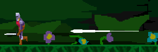
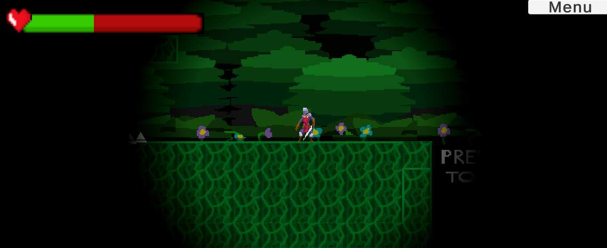
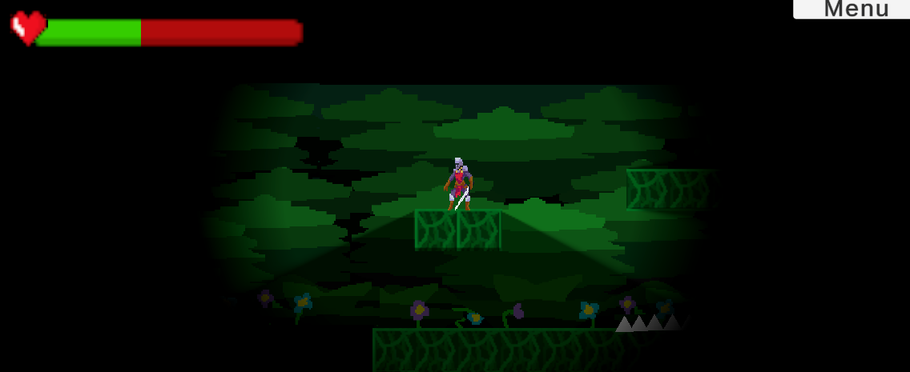

# Unity Game Development Summary

| Field | Detail |
|---|---|
| **Game Title** | Forest Explorer |
| **Student Name(s)** | Samuel H |
| **Class / Course** | Computer Technology |
| **Repository** | 2026CT_GameDesign_Forest_Samuel.H |
| **Unity Version** | 6000.0.58f1 |
| **Document Version** | 1.0 |
| **Date** | 21/9/2026 |

---

## Table of Contents
1. [Game Overview](#1-game-overview)
2. [Video Walkthrough](#2-video-walkthrough)
3. [Game Mechanics](#3-game-mechanics)
4. [Visual Features](#4-visual-features)
5. [Audio Design](#5-audio-design)
6. [User Interface & HUD](#6-user-interface--hud)
7. [Scene & Level Design](#7-scene--level-design)
8. [Scripts & Programming](#8-scripts--programming)
9. [Development Techniques & Tutorials Acknowledged](#9-development-techniques--tutorials-acknowledged)
10. [Third-Party Content Acknowledgements](#10-third-party-content-acknowledgements)
11. [Challenges & Solutions](#11-challenges--solutions)
12. [Branch Development Summary](#12-branch-development-summary)

---

## 1. Game Overview

### 1.1 Genre

2D Platformer.

### 1.2 Target Audience

Gamers from 8-20 years old.

### 1.3 Game Summary

The player is exploring a forest and needs to survive while avoiding dangers like spikes and racoons which deal damage to the player so they can reach the escape portal allowing the player to exit the forest and continue on their journey.

### 1.4 Win / Loss Conditions
| Condition | Description |
|---|---|
| Win | Beat/pass each level |
| Loss | Lose all health and die |

### 1.5 Platform & Build Settings
| Setting | Detail |
|---|---|
| Target Platform | PC and Console |
| Resolution | 720x1280 |
| Build Type | Release |

---

## 2. Video Walkthrough

### 2.1 Full Gameplay Walkthrough

<!--
  Embed a YouTube/Vimeo video or link to a file in the repository.
  YouTube embed syntax:
  

  OR link to a local file:
  [Watch Walkthrough Video](./docs/video/walkthrough.mp4)
-->

| Field | Detail |
|---|---|
| **Video Title** | Forest Explorer: Feature Walk Through |
| **Link / Embed** | |
| **Duration** | |
| **Description** | Showcases my game design with many different features, like a parallax background, movement, animation, health bar, hud, death and respawn all play a part |

### 2.2 Feature Highlight Clips

| Clip | Description | Link |
|---|---|---|
| | | |
| | | |
| | | |

---

## 3. Game Mechanics

### 3.1 Core Mechanics
| ID | Mechanic | Description | Implemented In (Script/Object) |
|---|---|---|---|
| M-1 | Player Movement | Complex player movement has been incorparated into the game, a dash, jump and run allowing the player to traverse the level| PlayerMovement.cs |
| M-2 | Health Bar System | Health bar system which tracks the players health based on interecations with other game objects like enemies and spikes. It tracks when the player takes damage and when to kill the player | HealthBarScript.cs and PlayerMovement.cs |
| M-3 | Main Menu | A menu where the player can decide which level to play, or to exit the game | StartMenuController.cs |
| M-4 | Enemies | A racoon for an enemy, which the player has to be careful of to avoid taking 30/100 damage. | Racoon.cs |
| M-5 | Animation | Animations which depicts the action being taken by the player, a run, a dash, a jump etc. | PlayerMovement.cs |

### 3.2 Player Controls
| Action | Input (Keyboard / Controller) | Description |
|---|---|---|
| Run left | A/Joystick Left | Moves player left |
| Run Right | D/Joystick Right | Moves player right |
| Jump | SpaceBar/A/X | Moves player upwards |
| Dash | Shift/L3/LeftThumbStick | Makes the player dash in the desired direction |

### 3.3 Physics & Collision
| Feature | Description |
|---|---|
| Ground Check | This feature checks whether the player is on the ground or not. This is essential because if the player is not on the ground, certain actions cannot be taken, like the jump. Not allowing the player to take the action of jumping while in the air prevents from an infinite jump. |
| Wall | Having an empty wall script allows me to attach the script to an object and control some aspects of the wall. Meaning that when the enemy racoon comes into contact with one of the two walls it will change direction and flip the animation to start going in the opposite direction. This prevents the racoon from falling off the platform.|

### 3.4 Game Loop
| Stage | Description |
|---|---|
| Start / Initialisation | When in the main menu the player can choose to start 1 of 2 levels, this initiates the game and allows the player to begin playing|
| Core Loop | After the initilistation the player will either die, and respawn to the start of the level giving them another attempt at the levek, or they will beat the level and reach the end, this will then transport the player to the main menu allowing the loop to restart giving them the option to start a new level or quit. |
| End State | The end state occurs at the main menu where the player can close the game by clicking exit |
| Restart | The restart occurs when the player dies and respawns to the beginning of the level |

### 3.5 Scoring & Progression
| Element | Description |
|---|---|
| Scoring System | N/A |
| Difficulty Progression | After passing level 1 the 2nd level progresses in difficulty and is much harder than the first level. |
| Unlockables / Levels | There are currently two playable levels which can be accessed from the ,main menu|

---

## 4. Visual Features

### 4.1 Particle Effects

| Effect Name | Purpose | Screenshot |
|---|---|---|
| Dash Trail | Renders a trail behind the player after dashing. | |
| N/A | N/A | N/A |
| N/A | N/A | N/A |

> Add screenshot images using: ``

---

### 4.2 Cut Scenes & Cinematics

| Cut Scene | Trigger | Description | Screenshot / Still |
|---|---|---|---|
| N/A | N/A | N/A | N/A |
| N/A | N/A | N/A | N/A |
| N/A | N/A | N/A | N/A |

> Add screenshot images using: ``

---

### 4.3 Animations

| Animation | Object / Character | Description | Screenshot |
|---|---|---|---|
| Run | Player  | The run animation plays when the parameter of speed > 0.01 |  |
| Jump | Player | The jump animation plays when the Y speed > 0.01 or <-0.1 |  |
| Dash | Player | The Dash animation will play when the isDashing Bool is equal to true |  |
| Idle | Player | The Idle animation plays when the speed parameter < 0.01 |  |
| Racoon Walk | Enemy | The racoon walk animation constantly plays |  | 

> Add screenshot images using: ``

---

### 4.4 Lighting & Post-Processing

| Feature | Description | Screenshot |
|---|---|---|
| Lighting | Lighting added to the player object and following the player around, allowing for the player to see the level |  |
| Shadows | Using a shadow caster 2D shadows have been added to objects in the level and respond to different lighting |  |

> Add screenshot images using: ``

---

### 4.5 Shaders & Materials

| Shader / Material | Applied To | Description | Screenshot |
|---|---|---|---|
| Front ParralaxBackground | Parralax Background | Front Section of the Parralax Background |  |
| Mid Parralax Background | Parralax Background | Mid Section of the Parralax Background|  |
| Back Parralax Background | Parralax Background | Back Section of the Parralax Background |  |
| Tile Pallate | Ground | Tile pallete square used to texture the ground |  |
| Player Texture | The player | Player animation texture applied to the player |   |
| Racoon Texture | The enemy | Racoon texture applied to the enemy object |   |
> Add screenshot images using: ``

---

### 4.6 Additional Visual Screenshots

<!--
  Add any other notable screenshots here.
  Syntax: 
-->

| Description | Screenshot |
|---|---|
| N/A | N/A |
| N/A | N/A |
| N/A | N/A |

---

## 5. Audio Design

### 5.1 Music
| Track | Scene / Trigger | Source / Composer |
|---|---|---|
| Tales of Adventure - Daniel Burgin | On load the background music will play | Youtube Blue Turtle |

### 5.2 Sound Effects
| Sound Effect | Trigger | Source |
|---|---|---|
| N/A | N/A | N/A |
| N/A | N/A | N/A |
| N/A | N/A | N/A |
| N/A | N/A | N/A |

### 5.3 Audio Implementation
| Feature | Description |
|---|---|
| Audio Mixer / Groups | N/A |
| Spatial / 3D Audio | N/A |
| Dynamic Audio | N/A |

---

## 6. User Interface & HUD

### 6.1 HUD Elements
| Element | Purpose | Screenshot |
|---|---|---|
| Shift to Dash! | Tells the Player How to Dash |  |
| Heatlh Bar | Shows the players current health and how close to death they are |  |

> Add screenshot images using: ``

### 6.2 Menus
| Menu | Purpose | Screenshot |
|---|---|---|
| Main Menu | To traverse the game allowing the player to either exit the game or select a level to play |  |
| Pause Menu | Takes the player from the current level back to the main menu |  |
| Game Over Screen | Shows that the player died | |

> Add screenshot images using: ``

---

## 7. Scene & Level Design

### 7.1 Scene List
| Scene Name | Purpose | Description |
|---|---|---|
| StartScene | Serves as the first scene in the whole game so the player can choose to start a level | The start scene is the scene which loads up first and allows the player to choose to start a level in the game or to exit the game |
| Game | Serves as the first level in Forest Adventure | Game is the first level in the game which the player can play through |
| Game2 | Serves as the second level in Forest Adventure | Game 2 is the second level in the game which the player can play through |

### 7.2 Level / Environment Screenshots
| Level / Area | Description | Screenshot |
|---|---|---|
| Level 1 | The first level in the game where the player tries to reach the end of the level and advance to level 2 |  |
| Level 2 | The second level in the game where the player triest to reach the end |  |

> Add screenshot images using: ``

### 7.3 Scene Management
| Feature | Description |
|---|---|
| Scene Loading Method | Loads the start scene first as default and based on different actions it will take the player to a different scene, such as game and game 2 |
| Persistent Data Between Scenes |  |
| Scene Transition Effects | A button connected to certain aspects of the game such as the pause menu in the game scene and other buttons on both the win and start screen allow the player to transition between scenes. |

---

## 8. Scripts & Programming

### 8.1 Script Summary
| Script Name | Attached To | Responsibility |
|---|---|---|
| DangerSpike.cs | Spikes | Deals Damage to the Player |
| Death_Barrier.cs | DeathBarrier | Kills the player when touched and is put in place to kill the player when falling out of the level |
| GameManager.cs | GameManager | Allows for game scenes and canvas's to be managed based on certain interactions with the game such as buttons |
| HealthBarScript.cs | HealthBar | Allows for the health bar to track and show how much health the player has |
| Menu_Script.cs | Menu | Allows the player to navigate back to the main menu when pressed |
| Parallax.cs | Parralax Backgrounds | Allows for each of the different backgrounds to move at different speeds and to create the parallax effect |
| PlayerHealth.cs | Player | Allows health bar to take damage and sets max health |
| PlayerMovement.cs | Player | Attached to the player and allows all sorts of functions that the player holds such as movement, damage, etc |
| Portal.cs | Portal | Allows for the game to end once the player comes into contact with the game object, displaying a canvas with buttons so the player can either replay, continue to the next level or exit the game |
| Racoon.cs | Enemy | Allows the racoon to deal damage and move on the x axis |
| StartMenu.cs | Menu button | Allows the player to return to the main menu from the game |
| StartMenuController | Canvas in StartScene | Controlls the Main menu |
| Wall | Platforms | In my racoon.cs it checks when something enters the trigger if it has the wall script attached, if so flip the racoon. So an empty script is attached to the partrol barriers to flip the racoon so it can keep patrolling the platform indefinitley.  |

### 8.2 Key Algorithms / Logic
| Feature | Script | Description |
|---|---|---|
| Dashing | PlayerMovement.cs | THe dash has to last 0.2 s, so Dash() is a coroutine started by StartCoroutine. The sequence is set canDash = false to make sure that you cannot spam dashign then it sets isDashing = true.
| GroundCheck | PlayerMovement.cs | The groundcheck is an object placed at the players feet and it asks if any other collider is touching the surface to check if the player 'isGrounded' the code  if (Input.GetKeyDown(KeyCode.Space) && isGrounded) makes sure that the player isGrounded before allowing it to jump this makes sure the player has to be on ground to jump and not in the air. |
| Parallax | Parallax.cs | The code parallaxMultiplier = 0.3, 0.2, 0.1 means that the backgrounds respectively travel 30% faster, 20%, and 10% faster than the camera following the player, which makes the background slide past the player slowly creating the parallax illusion and adding depth. |

### 8.3 Design Patterns Used
| Pattern | Where Applied | Justification |
|---|---|---|
| | | |
| | | |
| | | |

---

## 9. Development Techniques & Tutorials Acknowledged

> List every tutorial, course, video, or article that informed or guided your implementation. Include what you used it for and what you changed or adapted.

| # | Title | Author / Creator | URL / Source | What You Used It For | What You Changed / Adapted |
|---|---|---|---|---|---|
| 1 | | | | | |
| 2 | | | | | |
| 3 | | | | | |
| 4 | | | | | |
| 5 | | | | | |
| 6 | | | | | |
| 7 | | | | | |
| 8 | | | | | |

---

## 10. Third-Party Content Acknowledgements

> All third-party assets (art, audio, fonts, scripts, packages) must be listed here with their licence. Using an asset without acknowledgement may constitute academic misconduct.

### 10.1 Visual Assets
| Asset Name | Type | Creator / Source | Licence | URL | Used For |
|---|---|---|---|---|---|
| Health Bar | Image | Brackeys Youtube | CC0 | https://www.youtube.com/watch?v=BLfNP4Sc_iA | Health Bar UI |
| Heart | Image | Brackeys Youtube | CC0 | https://www.youtube.com/watch?v=BLfNP4Sc_iA | Health Bar UI |
| Hero Knight 2 | Animation | Luiz Melo Unity Assets Store | CC0 | https://assetstore.unity.com/packages/2d/characters/hero-knight-2-168019 | Player Animations |
| Racoon | Animation | Ned R | N/A | N/A | Enemy Animations |
| Tile Pallete | Image | Ned R | N/A | N/A | Ground objects |
| Background | Image | Ned R | N/A | N/A | Parralax Background |

### 10.2 Audio Assets
| Asset Name | Type | Creator / Source | Licence | URL | Used For |
|---|---|---|---|---|---|
| Tales of Adventure - Daniel Burgin | Music | Youtube Blue Turtle | Unknown | https://www.youtube.com/watch?v=GkSHE6wOzX0&t=4885s | Background music |
| N/A | N/A | N/A | N/A | N/A | N/A |
| N/A | N/A | N/A | N/A | N/A | N/A |

### 10.3 Scripts & Code Snippets
| Script / Snippet | Source | Licence | URL | Used For | Changes Made |
|---|---|---|---|---|---|
| public void OnStartClick()
    {
        SceneManager.LoadScene("Game");
    } public void OnExitClick()
    {
        #if UNITY_EDITOR
            UnityEditor.EditorApplication.isPlaying = false;
        #endif
            Application.Quit();
    } 
| | Youtube |  | https://www.youtube.com/watch?v=paaBTt5GcMU | Main menu | Added a script allowing the player to exit and start the game. |

  animator.SetFloat("Speed", Mathf.Abs(currentVelocityX)); | | Youtube |  | https://www.youtube.com/watch?v=hkaysu1Z-N8 | 2D Animation | Added script to enable animations and followed steps to get the animotor section in unity working |

private float horizontal;
    private float speed = 8f;
    private float jumpingPower = 16f;
    private bool isFacingRight = true;

    [SerializeField] private Rigidbody2D rb;
    [SerializeField] private Transform groundCheck;
    [SerializeField] private LayerMask groundLayer;

    void Update()
    {
        horizontal = Input.GetAxisRaw("Horizontal");

        if (Input.GetButtonDown("Jump") && IsGrounded())
        {
            rb.velocity = new Vector2(rb.velocity.x, jumpingPower);
        }

        if (Input.GetButtonUp("Jump") && rb.velocity.y > 0f)
        {
            rb.velocity = new Vector2(rb.velocity.x, rb.velocity.y * 0.5f);
        }

        Flip();
    }

    private void FixedUpdate()
    {
        rb.velocity = new Vector2(horizontal * speed, rb.velocity.y);
    }

    private bool IsGrounded()
    {
        return Physics2D.OverlapCircle(groundCheck.position, 0.2f, groundLayer);
    }

    private void Flip()
    {
        if (isFacingRight && horizontal < 0f || !isFacingRight && horizontal > 0f)
        {
            isFacingRight = !isFacingRight;
            Vector3 localScale = transform.localScale;
            localScale.x *= -1f;
            transform.localScale = localScale;
        }
    }| | Youtube |  | https://www.youtube.com/watch?v=K1xZ-rycYY8 | 2D Player movement | Added a script for player movement and followed steps to use this code in unity at the start of my game development |
void Start()
    {
        localScale = transform.localScale;
        rb = GetComponent<Rigidbody2D>();
        dirX = -1f;
        moveSpeed = 10f;
    }
    private void OnTriggerEnter2D(Collider2D collision)
{
    if (collision.GetComponent<Wall>())
    {
        dirX *= -1f;
    }
}

 void FixedUpdate()
    {
        rb.linearVelocity = new Vector2(dirX * moveSpeed, rb.linearVelocity.y);
    }

    void LateUpdate()
    {
        CheckWhereToFace();
    }

    void CheckWhereToFace()
    {
        if (dirX > 0)
            facingRight = true;
        else if (dirX < 0)
            facingRight = false;

        if (((facingRight) && (localScale.x < 0)) || ((!facingRight) && (localScale.x > 0)))
            localScale.x *= -1;

        transform.localScale = localScale;
    }

| | Youtube |  | https://www.youtube.com/watch?v=NbA95f1FlXQ | Enemy patrolling | Added a script to two player objects allowing the enemys to patroll a certain area |
    private void OnTriggerEnter2D(Collider2D collision)
    {
        if (collision.CompareTag("Player"))
        {
            healthBar.TakeDamage(DamageAmount);
        }
    }
| | Youtube |  | https://www.youtube.com/watch?v=2IvpxG1dyls | Spike Damage | Added a script for spikes to deal damage to the player |
    private IEnumerator Dash()
    {
        canDash = false;
        animator.SetBool("IsDashing", isDashing = true);
        float originalGravity = rb.gravityScale;
        rb.gravityScale = 0f;
        rb.linearVelocity = new Vector2(moveInput * dashingpower, 0f);
        tr.emitting = true;
        yield return new WaitForSeconds(dashingTime);
        tr.emitting = false;
        rb.gravityScale = originalGravity;
        animator.SetBool("IsDashing", isDashing = false);
        yield return new WaitForSeconds(dashingCooldown);
        canDash = true;
    }| | Youtube |  | https://www.youtube.com/watch?v=2kFGmuPHiA0 | Dashing | Added script allowing the player to dash |

    [SerializeField] private Slider slider;

    private void Awake()
    {
        if (slider == null)
        {
            slider = GetComponent<Slider>();
        }

        if (slider == null)
        {
            Debug.LogError("HealthBarScript: No Slider assigned or found on this GameObject.");
        }
    }

    public void SetMaxHealth(int health)
    {
        slider.maxValue = health;
        slider.value = health;
    }

    void Start()
    {
        SetMaxHealth(100);
    }

    public void TakeDamage(int damage)
    {
        var newHealth = slider.value - damage;
        slider.value = newHealth;

        if (slider.value == 0)
        {
            Debug.Log("Player is dead!");
        }
    }
| | Youtube |  | https://www.youtube.com/watch?v=BLfNP4Sc_iA | Health Bar | Added a script allowing the player to track damage.

### 10.4 Unity Packages & Plugins
| Package Name | Version | Source | Licence | URL | Purpose |
|---|---|---|---|---|---|
| Hero Knight 2 | 1.0 | Unity | CC0 | https://assetstore.unity.com/packages/2d/characters/hero-knight-2-168019 | Player Animations |

### 10.5 Fonts
| Font Name | Creator / Source | Licence | URL |
|---|---|---|---|
| N/A | N/A | N/A | N/A |

---

## 11. Challenges & Solutions

| # | Challenge Encountered | How It Was Solved |
|---|---|---|
| 1 | Animating the player object | The challenge of animating the player object was a hard challenge to surpass. This is because no animation tutorial videos seemed to work, either they were too out of date or they just failed to work no matter how much I tried. After a couple lessons I solved this problem by combining multiple animation videos together, taking bits from one tutorial that worked, and putting them in where the other tutorial failed. |
| 2 | Communicating with multimedia partner | Communicating with my multimedia partner was another challenge that I encounted. On the first day we exchanged numbers, this I thought would fix the problem of communication, however it did not. I did my part by communicating through the app of our choice 'whatsapp' updating him on what I had completing and asking him for assets which he created, however on most occasions he would ghost me, no updates, no "Yep i'm still working on this" Eventually I solved this problem by finding him at lunch and talking to him inperson. Ultimatley after poor communication I recieved less than suitible assets, wtih only 1/3 suiting my needs. |
| 3 | Starting | Another more simple challenge I encounted was on the first lesson when starting our game, I was utterly and completely lost. After working for over a term on a 3D rollerball game I became familiar with the unity tool, however starting a 2D game was something completely new to me and I was completely out of my league as a developer. However after following numerous tutorials on how to start making a game I ended up with a very simple movement script, and my scene, more and more started to resemble a game. |

---

## 12. Branch Development Summary

> One section per feature branch. Add or remove sections to match your repository. Branches should be named for the feature they implement e.g. `feature/player-movement`. Link each branch name directly to the branch in your GitHub repository.

---

### Branch 1 — `main`

| Field | Detail |
|---|---|
| **Branch Name** | `main` |
| **Purpose** | Stable, releasable version of the game |
| **Merged From** | |
| **Final Commit** | |

---

### Branch 2 — `feature/`

| Field | Detail |
|---|---|
| **Branch Name** | |
| **Feature Developed** | |
| **Merged Into** | |
| **Date Started** | |
| **Date Merged** | |

#### What Was Built
<!-- Describe what this branch added or changed -->

#### Key Commits
| Commit Message | What Changed |
|---|---|
| | |
| | |
| | |

#### Problems Encountered & Resolved
| Problem | Resolution |
|---|---|
| | |
| | |

#### Screenshot / Evidence
<!-- Add a screenshot of the feature working -->
> ``

---

### Branch 3 — `feature/`

| Field | Detail |
|---|---|
| **Branch Name** | |
| **Feature Developed** | |
| **Merged Into** | |
| **Date Started** | |
| **Date Merged** | |

#### What Was Built

#### Key Commits
| Commit Message | What Changed |
|---|---|
| | |
| | |
| | |

#### Problems Encountered & Resolved
| Problem | Resolution |
|---|---|
| | |
| | |

#### Screenshot / Evidence
> ``

---

### Branch 4 — `feature/`

| Field | Detail |
|---|---|
| **Branch Name** | |
| **Feature Developed** | |
| **Merged Into** | |
| **Date Started** | |
| **Date Merged** | |

#### What Was Built

#### Key Commits
| Commit Message | What Changed |
|---|---|
| | |
| | |
| | |

#### Problems Encountered & Resolved
| Problem | Resolution |
|---|---|
| | |
| | |

#### Screenshot / Evidence
> ``

---

### Branch 5 — `feature/`

| Field | Detail |
|---|---|
| **Branch Name** | |
| **Feature Developed** | |
| **Merged Into** | |
| **Date Started** | |
| **Date Merged** | |

#### What Was Built

#### Key Commits
| Commit Message | What Changed |
|---|---|
| | |
| | |
| | |

#### Problems Encountered & Resolved
| Problem | Resolution |
|---|---|
| | |
| | |

#### Screenshot / Evidence
> ``

---

### Branch 6 — `feature/`

| Field | Detail |
|---|---|
| **Branch Name** | |
| **Feature Developed** | |
| **Merged Into** | |
| **Date Started** | |
| **Date Merged** | |

#### What Was Built

#### Key Commits
| Commit Message | What Changed |
|---|---|
| | |
| | |
| | |

#### Problems Encountered & Resolved
| Problem | Resolution |
|---|---|
| | |
| | |

#### Screenshot / Evidence
> ``

---

### Branch Development Overview

> Complete this summary table once all branches are finished.

| Branch Name | Feature | Date Started | Date Merged | Status |
|---|---|---|---|---|
| `main` | Stable release | | | |
| `feature/` | | | | |
| `feature/` | | | | |
| `feature/` | | | | |
| `feature/` | | | | |
| `feature/` | | | | |

---

> **Student Declaration:** All work submitted is my own except where explicitly acknowledged above.